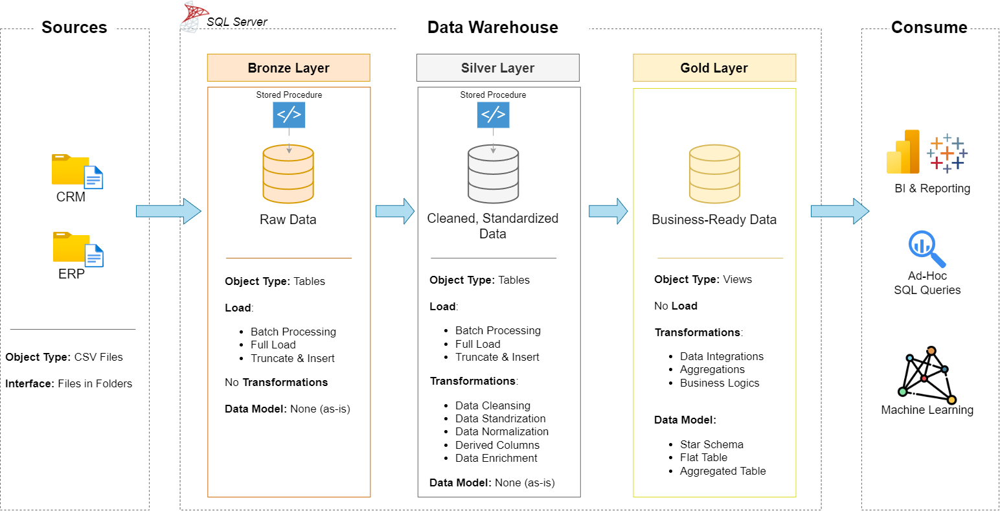

# 📊 Data Warehouse & Analytics Project  

Welcome to the **Data Warehouse & Analytics Project**! 🚀  
This repository showcases an **end-to-end data warehousing and analytics solution**, covering everything from raw data ingestion to delivering actionable business insights.  

Designed as a portfolio project, it highlights **industry-standard practices** in data engineering, data modeling, and analytics.  

---

##  Data Architecture  

The project is built on the **Medallion Architecture** with three structured layers:  

  

1. **Bronze Layer** – Stores raw data ingested directly from source systems (ERP & CRM via CSV files) into SQL Server.  
2. **Silver Layer** – Cleansed, standardized, and transformed data, ensuring quality and consistency.  
3. **Gold Layer** – Business-ready, analytics-optimized data modeled into a **star schema** for reporting.  

---

##  Project Highlights  

This project demonstrates:  

- **Data Architecture** – Designing a modern data warehouse using Medallion principles.  
- **ETL Pipelines** – Extract, transform, and load workflows to move and refine data.  
- **Data Modeling** – Development of **fact** and **dimension** tables for efficient querying.  
- **Analytics & Reporting** – SQL-based analysis and dashboards for business insights.  

Ideal portfolio project for demonstrating skills in:  
- SQL Development  
- Data Engineering  
- ETL & Pipeline Design  
- Data Modeling  
- Business Intelligence & Analytics  

---

##  Project Requirements  

### Objective  
Build a **modern data warehouse on SQL Server** to consolidate ERP and CRM sales data, enabling advanced reporting and data-driven decision-making.  

### Specifications  
- **Data Sources**: Two CSV-based systems (ERP & CRM).  
- **Data Quality**: Cleansing, deduplication, and normalization before analytics.  
- **Integration**: Unified data model, easy to query for business use cases.  
- **Scope**: Focused on the latest snapshot (no historization).  
- **Documentation**: Clear data model documentation for both technical and business users.  

---


##  Repository Structure
```
data-warehouse-project/
│
├── datasets/                           # Datasets used for the project
│
├── docs/                               # Architecture details
│   ├── data_architecture.drawio        # Draw.io file shows the project's architecture
│   ├── data_flow.drawio                # Draw.io file for the data flow diagram
│   ├── data_models.drawio              # Draw.io file for data models (star schema)
│
├── scripts/                            # SQL scripts for ETL and transformations
│   ├── bronze/                         # Scripts for extracting and loading raw data
│   ├── silver/                         # Scripts for cleaning and transforming data
│   ├── gold/                           # Scripts for creating analytical models
│
├── tests/                              # Test scripts and quality files
│
├── README.md                           # Project overview and instructions
├── LICENSE                             # License information for the repository
├── .gitignore                          # Files and directories to be ignored by Git
└── requirements.txt                    # Dependencies and requirements for the project
```
---
## 🚀 Outcome  

By the end of this project, you will see how **raw CSV files** evolve into **structured insights**, going through proper staging, transformation, modeling, and analytics layers — mimicking **real-world enterprise data practices**.  
